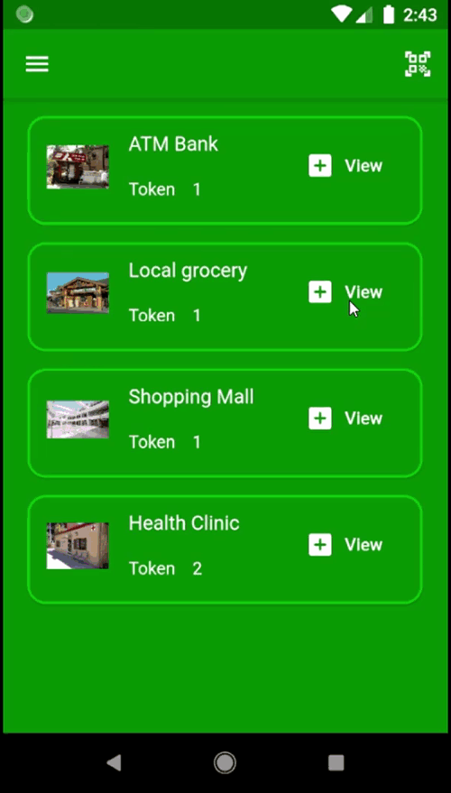
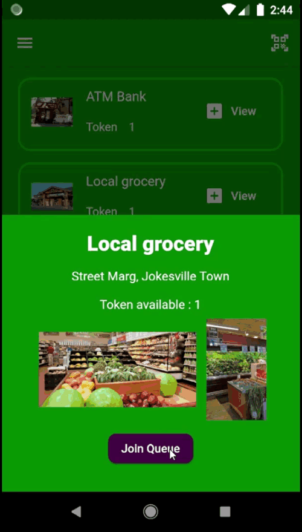
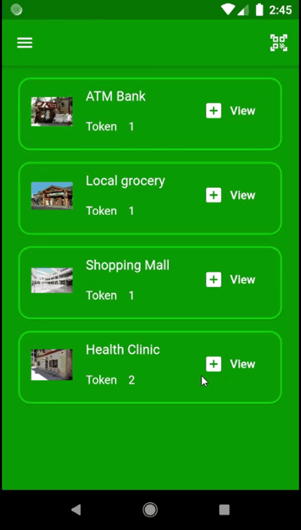
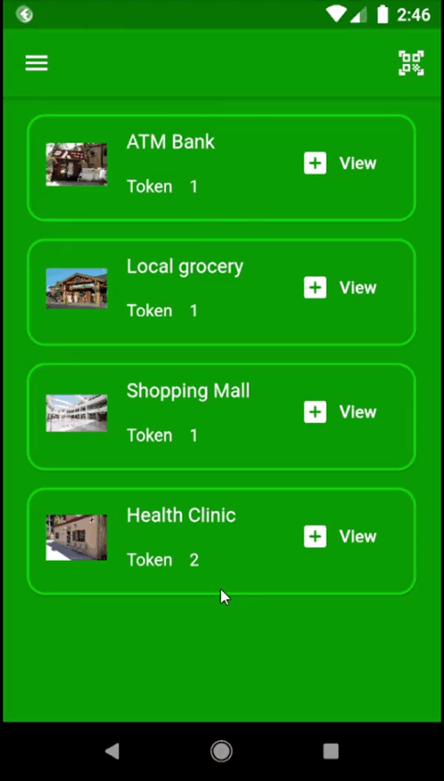

<h1 align="center">VirQ</h1>

<h2>Introduction</h2>

 VirQ is a solution aimed at resolving issues related to the conventional physical queues that are often observed at various public institutions, hospitals/clinics, ATMs and grocery/general stores.

 Physcial queues evolved as a way to maintain priority order and integrity. Despite this, there are no gurantees about the integrity beign maintained since people often find ways/excuses to jump queues.

Some common problems associated with the conventional physical queues are :
<ul>
  <li>Physical exhaustion</li>
  <li>Time wastage</li>
  <li>Inability to maintain physical distancing</li>
  </ul>

 VirQ overcomes these issues by allowing users to join a queue and book a spot using an app interface. Once the user enrolls in a queue, their token number along with expected waiting time is provided and is updated regularly. As time passes by and the turn is about to come, the user is reminded using app notifications.

The advantages of this approach are :

<ul>
  <li>Preserves the order and integrity</li>
  <li>Prevents crowding</li>
  <li>Allows physical distancing</li>
  <li>Regular updates about queue's status to user</li>
  </ul>

<h2>Working</h2>

The whole procedure can be explained in five steps:
<ul>
  <li>Sign-up or sign-in by the user.</li>
  <li>The home screen displays a list of insitutions and shops nearby along with the available token for booking a spot in the queue. The user can join a queue as appropriate.</li>
  <li> Once the booking is confirmed, the user is notified about the allotted token and the expected waiting time.</li>
  <li> As time passes, the queue is updated in real-time and the user is updated constantly about the queue's status.</li>
  <li> The user is reminded to visit the location once the turn is about to come.</li>
  </ul>

<h2>Demo</h2>

<table>
  <tr>
  <td></td>
  <td></td>
  <td></td>
  <td></td>
  </tr>
  
  <tr>
  <td>
Viewing details of a queue
</td>
  <td>
Joining a queue
</td>
  <td>
Joining when the queue was not previously empty
</td>
  <td>
Reminder about the turn
</td>
  </tr>
</table>

<h2>Tools</h2>

<ul>
  <li> Flutter: 1.22.6 (stable)</li>
  <li> Dart: 2.10.5</li>
  </ul>
